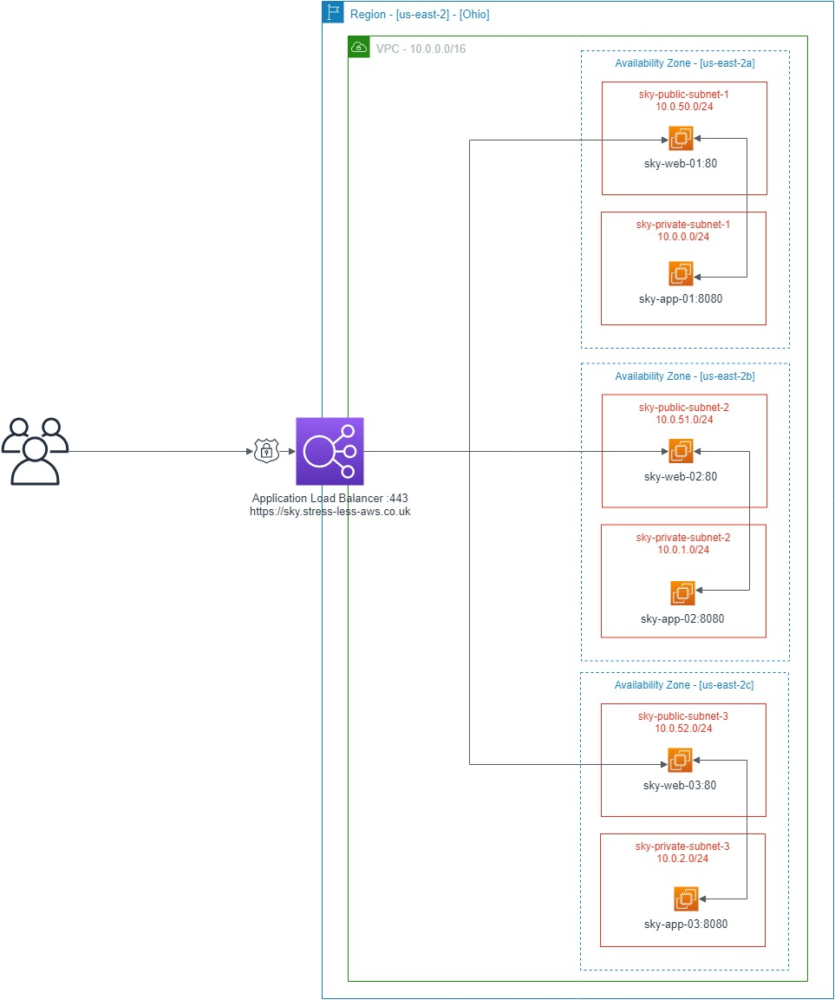

Auther: Tyrone France

Creation date: 26/07/2019

This guide will talk you through building an 
entire AWS MultiAZ Stack with 3 x web-servers
using Ansible in AWS US-EAST-2 [OHIO]

**Note**: After your initial launch it may take a while for the DNS to propagate the update for the ALB - [sky.stress-less-aws.co.uk](https://sky.stress-less-aws.co.uk/) so feel free to add an ip for the ELB to your hosts file.


### AWS STACK

- [x] 1 x AWS VPC
- [x] 3 x Web EC2 Instances in zone a/b/c
- [ ] 3 x App EC2 Instances in zone a/b/c - [Will do in the future]
- [ ] 1 x Oracle MultiAZ RDS Instance in zone a/b/c - [Will do in the future]
- [x] 4 x elastic ips
- [x] 3 x nat gateways in zone a/b/c
- [x] 1 x Internet gateway
- [x] 3 x private subnets in zone a/b/c
- [ ] 3 x private RDS subnets in zone a/b/c - [Will do in the future]
- [x] 3 x public subnets in zone a/b/c
- [x] 1 x elastic load balancer
- [x] 1 x route53 automated DNS attachment
- [x] 1 x automated SSL certificate attachment

### LOGICAL DIAGRAM


### PREREQUISITS

### AMAZON AWS RESOURCE LIMITS:
Ensure you have the appropriate AWS permissions and AWS Resource limits for the above infrastructure.


**AWS CLI:**
```
└─╾ aws --version
aws-cli/1.16.198 Python/2.7.15+ Linux/4.15.0-52-generic botocore/1.12.188
```

**ANSIBLE:**
```
└─╾ ansible --version
ansible 2.8.2
  config file = /etc/ansible/ansible.cfg
  configured module search path = ['/root/.ansible/plugins/modules', '/usr/share/ansible/plugins/modules']
  ansible python module location = /usr/local/lib/python3.6/dist-packages/ansible
  executable location = /usr/local/bin/ansible
  python version = 3.6.8 (default, Jan 14 2019, 11:02:34) [GCC 8.0.1 20180414 (experimental) [trunk revision 259383]]
```

**PYTHON:**
```
└─╾ python3 --version
Python 3.6.8

└─╾ python --version
Python 2.7.15+
```

### CLONE THE PROJECT TO YOUR MACHINE
1.) Clone the SKY Project
```
cd /etc/ansible/
git clone https://github.com/tyronefrance/sky.git
```

### CREATE A PRODUCTION READY KEY WITH EC2 KEYPAIR

1.) Connect AWS CLI to your AWS Environment
```
└─╾ aws configure
AWS Access Key ID [****************WLUQ]:
AWS Secret Access Key [****************Y1eJ]:
Default region name [None]: us-east-2
Default output format [None]: json
```

2.) You dont have to do this step but I have created a profile for this to easily switch between accounts. "ie: export AWS_PROFILE=sky-pro-multiaz"

~/.aws/config
```
[profile sky-pro-multiaz]
output = text
region = us-east-2
```
~/.aws/credentials
```
[sky-pro-multiaz]
aws_access_key_id = ****************WLUQ
aws_secret_access_key = ****************Y1eJ
```

3.) Create a New Primary Key Pair for you EC2 Instances - [sky-production-key.pem]
```
└─╾ aws ec2 --region=us-east-2 create-key-pair --key-name sky-production-key --query 'KeyMaterial' --output text > sky-production-key.pem
```

4.) Set the appropriate permissions on the new key
```
└─╾ chmod 400 /etc/ansible/sky/sky-production-key.pem
```

5.) You should now have a private key called "sky-production-key.pem"
```
└─╾ ll /etc/ansible/sky/sky-production-key.pem
-rw-r--r-- 1 root root 1675 Jul 25 17:03 /etc/ansible/sky/sky-production-key.pem
```

6.) Update the [aws_vars.yml] with the new key name. "note the key name not the key file.pem"
```
└─╾ cat /etc/ansible/sky/aws_vars.yml | grep key
key_name: sky-production-key
```

### PURCHASE A VALID DNS NAME FROM ROUTE53 WITHIN YOUR AWS ACCOUNT

1.) In my example I have purchased "stress-less-aws.co.uk"

2.) Take a note of the "hosted_zone_name" and add it to the [aws_vars.yml]
```
└─╾ cat /etc/ansible/sky/aws_vars.yml | grep zone
hosted_zone_name: "stress-less-aws.co.uk"
```


### REQUEST AND GENERATE A WEB CERTIFICATE FOR THE ALB HTTPS LISTENER:443

1.) Now we need an SSL certificate for us to use later when building out our stack
```
└─╾ aws acm request-certificate --domain-name stress-less-aws.co.uk --validation-method DNS --subject-alternative-names *.stress-less-aws.co.uk
{
    "CertificateArn": "arn:aws:acm:us-east-2:168878865077:certificate/1234ab5c6-1d29-5457-9087-01648bc60701"
}
```

2.) Take a note of the certificate ARN and add it to the [aws_vars.yml]
```
└─╾ cat /etc/ansible/sky/aws_vars.yml | grep cert
cert_arn: "arn:aws:acm:us-east-2:168878865077:certificate/1234ab5c6-1d29-5457-9087-01648bc60701"
```

3.) `IMPORTANT` - Dont forget to validate your certificate via DNS. If you browse to the AWS Certificate Manager Console you should see the certificate waiting to be validated there.
[https://us-east-2.console.aws.amazon.com/acm/home?region=us-east-2](https://us-east-2.console.aws.amazon.com/acm/home?region=us-east-2)

"The DNS record was written to your Route 53 hosted zone. It can take 30 minutes or longer for the changes to propagate and for AWS to validate the domain and issue the certificate."

For me the certificate took 16 minutes to be validated:
```
Requested at	2019-07-25T19:19:26UTC
Issued at	2019-07-25T19:35:42UTC
```

### LETS INSPECT OUR PRE-DEFINED VARIABLES - [aws_vars.yml]

We can define the parameters below to fully customize our stack. There are a few things to bare in mind. Earlier we created the ec2key pair (sky-production-key). 

* KeyPairs in AWS are not global. So if you choose a different region as per what I have defined "us-east-2" Then you will need to recreate a new key in that region.
* AMIs are not global. So if you choose a different region as per what I have defined "us-east-2" Then you will need to use another "Ubuntu 14.04 LTS" ami from that other region.

```
└─╾ cat aws_vars.yml
####################################################
# Auther: Tyrone France                            #
# Creation date: 25/07/2019                        #
#                                                  #
# /etc/ansible/aws_vars.yml                        #
# -------------------------                        #
####################################################
instance_type: t2.nano
ami: ami-0986c2ac728528ac2  # Ubuntu 14.04 LTS
app_code_user: "ubuntu" # remote user
env: production
aws_region:     "us-east-2"
vpc_name:       "sky-production"
vpc_cidr_block: "10.0.0.0/16"
my_ip_range:          "194.11.22.33/32" # curl ifconfig.co
public_subnet_1_cidr:  "10.0.50.0/24"
public_subnet_2_cidr:  "10.0.51.0/24"
public_subnet_3_cidr:  "10.0.52.0/24"
private_subnet_1_cidr:  "10.0.0.0/24"
private_subnet_2_cidr:  "10.0.1.0/24"
private_subnet_3_cidr:  "10.0.2.0/24"
key_name: sky-production-key
hosted_zone_name: "stress-less-aws.co.uk"
cert_arn: "arn:aws:acm:us-east-2:168878865077:certificate/1234ab5c6-1d29-5457-9087-01648bc60701"
```

### LAUNCH GO GO GO

Now we can launch the AWS stack with ansible-playbook ensuring to export the below variables and defining the key to use.

```
└─╾ export AWS_PROFILE=sky-pro-multiaz
└─╾ export ANSIBLE_HOST_KEY_CHECKING=False
└─╾ ansible-playbook aws_stack.yml --private-key /etc/ansible/sky/sky-production-key.pem

PLAY RECAP ********************************************************************************************************
18.219.108.199             : ok=5    changed=3    unreachable=0    failed=0    skipped=0    rescued=0    ignored=0
18.222.186.57              : ok=5    changed=3    unreachable=0    failed=0    skipped=0    rescued=0    ignored=0
3.15.156.239               : ok=5    changed=3    unreachable=0    failed=0    skipped=0    rescued=0    ignored=0
localhost                  : ok=37   changed=29   unreachable=0    failed=0    skipped=0    rescued=0    ignored=0
```


### NOTES

`IMPORTANT` - Please note that after your initial launch it may take a while for the DNS to propagate the update for the ALB - [sky.stress-less-aws.co.uk] so feel free to add an ip for the ELB to your hosts file.

Dont forget to hit refresh several times in your browser and see the load balancer balancing the traffic between all three servers.

I have changed all the id/ips/certs/keys since this tutorial launch.
  
Please understand this is a test environment so I have setup 3 x web servers each with different content to show the load-balancer is doing its job. 

Currently the 3 x web servers will be accessible via ssh only from your source IP and they are locked down to only receive traffic on port 80 from the Elastic Load-balancer in front of it.

The load-balancer itself is configured to only receive traffic on port 443 from 0.0.0.0/0. I could also have utilized 'Ansible Vault' to encrypt and parameterize the AWS KEY/SECRET for more security but I did not have time.

I have also not added a Bastian host as I did not have time to do so.

I also did not have time to create a tear down script.


<details><summary>EXAMPLE RUN</summary>
<p>

```python
└─╾ ansible-playbook aws_stack.yml --private-key /etc/ansible/sky/sky-production-key.pem

PLAY [AWS MultiAZ VPC Web Cluster] **********************************************************************************************************************************************************************************************************

TASK [include_vars] *************************************************************************************************************************************************************************************************************************
ok: [localhost]

TASK [Creating MultAZ VPC - [Zone A/B/C]] ***************************************************************************************************************************************************************************************************
changed: [localhost]

TASK [Setting VPC ID - [Thats a Fact] :p] ***************************************************************************************************************************************************************************************************
ok: [localhost]

TASK [Creating Private Subnet - [Zone A]] ***************************************************************************************************************************************************************************************************
changed: [localhost]

TASK [Creating Private Subnet - [Zone B]] ***************************************************************************************************************************************************************************************************
changed: [localhost]

TASK [Creating Private Subnet - [Zone C]] ***************************************************************************************************************************************************************************************************
changed: [localhost]

TASK [Creating Public Subnet - [Zone A]] ****************************************************************************************************************************************************************************************************
changed: [localhost]

TASK [Creating Public Subnett - [Zone B]] ***************************************************************************************************************************************************************************************************
changed: [localhost]

TASK [Creating Public Subnett - [Zone C]] ***************************************************************************************************************************************************************************************************
changed: [localhost]

TASK [Creating Internet Gateway 1/1 for VPC] ************************************************************************************************************************************************************************************************
changed: [localhost]

TASK [Creating NAT Gateway 1/3 + EIP - [Zone A]] ********************************************************************************************************************************************************************************************
changed: [localhost]

TASK [Creating NAT Gateway 2/3 + EIP - [Zone B]] ********************************************************************************************************************************************************************************************
changed: [localhost]

TASK [Creating NAT Gateway 3/3 + EIP - [Zone C]] ********************************************************************************************************************************************************************************************
changed: [localhost]

TASK [Creating Public Subnet Route Table Using Internet-GW - [Zone A/B/C]] *****************************************************************************************************************************************************************************************************
changed: [localhost]

TASK [Creating Private Subnet Route Table Using NAT-GW - [Zone A]] **************************************************************************************************************************************************************************
changed: [localhost]

TASK [Creating Private Subnet Route Table Using NAT-GW - [Zone B]] **************************************************************************************************************************************************************************
changed: [localhost]

TASK [Creating Private Subnet Route Table Using NAT-GW - [Zone C]] **************************************************************************************************************************************************************************
changed: [localhost]

PLAY [Creating ALB and Web Instances] *******************************************************************************************************************************************************************************************************

TASK [include_vars] *************************************************************************************************************************************************************************************************************************
ok: [localhost]

TASK [Creating Operations Security Group] ***************************************************************************************************************************************************************************************************
changed: [localhost]

TASK [Creating ALB Security Group] **********************************************************************************************************************************************************************************************************
changed: [localhost]

TASK [Creating EC2 Web Security Group] ******************************************************************************************************************************************************************************************************
changed: [localhost]

TASK [Creating EC2 instance - [web-01] - [Zone A]] ******************************************************************************************************************************************************************************************
changed: [localhost]

TASK [Waiting for [web-01] to appear on the network] ****************************************************************************************************************************************************************************************
ok: [localhost] => (item={u'ramdisk': None, u'kernel': None, u'root_device_type': u'ebs', u'private_dns_name': u'ip-10-0-50-29.us-east-2.compute.internal', u'block_device_mapping': {u'/dev/sda1': {u'status': u'attached', u'delete_on_termination': True, u'volume_id': u'vol-0edd62eab53a24e2a'}}, u'key_name': u'sky-production-key', u'public_ip': u'18.224.52.109', u'image_id': u'ami-0986c2ac728528ac2', u'tenancy': u'default', u'private_ip': u'10.0.50.29', u'groups': {u'sg-0151fc83d20a81ed5': u'web-ec2-access', u'sg-0f4147a903812182c': u'ops-ec2-access'}, u'public_dns_name': u'ec2-18-224-52-109.us-east-2.compute.amazonaws.com', u'state_code': 16, u'id': u'i-04e8141eed7f46890', u'tags': {u'Name': u'sky-web-01'}, u'placement': u'us-east-2a', u'ami_launch_index': u'0', u'dns_name': u'ec2-18-224-52-109.us-east-2.compute.amazonaws.com', u'region': u'us-east-2', u'ebs_optimized': False, u'launch_time': u'2019-07-25T23:07:17.000Z', u'instance_type': u't2.nano', u'state': u'running', u'architecture': u'x86_64', u'hypervisor': u'xen', u'virtualization_type': u'hvm', u'root_device_name': u'/dev/sda1'})

TASK [Adding [web-01] ip addresses to hosts group] ******************************************************************************************************************************************************************************************
changed: [localhost] => (item={u'ramdisk': None, u'kernel': None, u'root_device_type': u'ebs', u'private_dns_name': u'ip-10-0-50-29.us-east-2.compute.internal', u'block_device_mapping': {u'/dev/sda1': {u'status': u'attached', u'delete_on_termination': True, u'volume_id': u'vol-0edd62eab53a24e2a'}}, u'key_name': u'sky-production-key', u'public_ip': u'18.224.52.109', u'image_id': u'ami-0986c2ac728528ac2', u'tenancy': u'default', u'private_ip': u'10.0.50.29', u'groups': {u'sg-0151fc83d20a81ed5': u'web-ec2-access', u'sg-0f4147a903812182c': u'ops-ec2-access'}, u'public_dns_name': u'ec2-18-224-52-109.us-east-2.compute.amazonaws.com', u'state_code': 16, u'id': u'i-04e8141eed7f46890', u'tags': {u'Name': u'sky-web-01'}, u'placement': u'us-east-2a', u'ami_launch_index': u'0', u'dns_name': u'ec2-18-224-52-109.us-east-2.compute.amazonaws.com', u'region': u'us-east-2', u'ebs_optimized': False, u'launch_time': u'2019-07-25T23:07:17.000Z', u'instance_type': u't2.nano', u'state': u'running', u'architecture': u'x86_64', u'hypervisor': u'xen', u'virtualization_type': u'hvm', u'root_device_name': u'/dev/sda1'})

TASK [Creating EC2 instance - [web-02] - [Zone A]] ******************************************************************************************************************************************************************************************
changed: [localhost]

TASK [Waiting for the [web-02] to appear on the network] ************************************************************************************************************************************************************************************
ok: [localhost] => (item={u'ramdisk': None, u'kernel': None, u'root_device_type': u'ebs', u'private_dns_name': u'ip-10-0-51-103.us-east-2.compute.internal', u'block_device_mapping': {u'/dev/sda1': {u'status': u'attached', u'delete_on_termination': True, u'volume_id': u'vol-09ab29306df66bec6'}}, u'key_name': u'sky-production-key', u'public_ip': u'52.15.82.79', u'image_id': u'ami-0986c2ac728528ac2', u'tenancy': u'default', u'private_ip': u'10.0.51.103', u'groups': {u'sg-0151fc83d20a81ed5': u'web-ec2-access', u'sg-0f4147a903812182c': u'ops-ec2-access'}, u'public_dns_name': u'ec2-52-15-82-79.us-east-2.compute.amazonaws.com', u'state_code': 16, u'id': u'i-0086bd1383063aa9e', u'tags': {u'Name': u'sky-web-02'}, u'placement': u'us-east-2b', u'ami_launch_index': u'0', u'dns_name': u'ec2-52-15-82-79.us-east-2.compute.amazonaws.com', u'region': u'us-east-2', u'ebs_optimized': False, u'launch_time': u'2019-07-25T23:07:55.000Z', u'instance_type': u't2.nano', u'state': u'running', u'architecture': u'x86_64', u'hypervisor': u'xen', u'virtualization_type': u'hvm', u'root_device_name': u'/dev/sda1'})

TASK [Adding [web-02] ip addresses to hosts group] ******************************************************************************************************************************************************************************************
changed: [localhost] => (item={u'ramdisk': None, u'kernel': None, u'root_device_type': u'ebs', u'private_dns_name': u'ip-10-0-51-103.us-east-2.compute.internal', u'block_device_mapping': {u'/dev/sda1': {u'status': u'attached', u'delete_on_termination': True, u'volume_id': u'vol-09ab29306df66bec6'}}, u'key_name': u'sky-production-key', u'public_ip': u'52.15.82.79', u'image_id': u'ami-0986c2ac728528ac2', u'tenancy': u'default', u'private_ip': u'10.0.51.103', u'groups': {u'sg-0151fc83d20a81ed5': u'web-ec2-access', u'sg-0f4147a903812182c': u'ops-ec2-access'}, u'public_dns_name': u'ec2-52-15-82-79.us-east-2.compute.amazonaws.com', u'state_code': 16, u'id': u'i-0086bd1383063aa9e', u'tags': {u'Name': u'sky-web-02'}, u'placement': u'us-east-2b', u'ami_launch_index': u'0', u'dns_name': u'ec2-52-15-82-79.us-east-2.compute.amazonaws.com', u'region': u'us-east-2', u'ebs_optimized': False, u'launch_time': u'2019-07-25T23:07:55.000Z', u'instance_type': u't2.nano', u'state': u'running', u'architecture': u'x86_64', u'hypervisor': u'xen', u'virtualization_type': u'hvm', u'root_device_name': u'/dev/sda1'})

TASK [Creating EC2 instance - [web-03] - [Zone B]] ******************************************************************************************************************************************************************************************
changed: [localhost]

TASK [Waiting for the [web-03] to appear on the network] ************************************************************************************************************************************************************************************
ok: [localhost] => (item={u'ramdisk': None, u'kernel': None, u'root_device_type': u'ebs', u'private_dns_name': u'ip-10-0-52-118.us-east-2.compute.internal', u'block_device_mapping': {u'/dev/sda1': {u'status': u'attached', u'delete_on_termination': True, u'volume_id': u'vol-008a95c3f295560ae'}}, u'key_name': u'sky-production-key', u'public_ip': u'18.222.149.39', u'image_id': u'ami-0986c2ac728528ac2', u'tenancy': u'default', u'private_ip': u'10.0.52.118', u'groups': {u'sg-0151fc83d20a81ed5': u'web-ec2-access', u'sg-0f4147a903812182c': u'ops-ec2-access'}, u'public_dns_name': u'ec2-18-222-149-39.us-east-2.compute.amazonaws.com', u'state_code': 16, u'id': u'i-0dc56fccb7074e8d4', u'tags': {u'Name': u'sky-web-03'}, u'placement': u'us-east-2c', u'ami_launch_index': u'0', u'dns_name': u'ec2-18-222-149-39.us-east-2.compute.amazonaws.com', u'region': u'us-east-2', u'ebs_optimized': False, u'launch_time': u'2019-07-25T23:08:36.000Z', u'instance_type': u't2.nano', u'state': u'running', u'architecture': u'x86_64', u'hypervisor': u'xen', u'virtualization_type': u'hvm', u'root_device_name': u'/dev/sda1'})

TASK [Adding [web-03] ip addresses to hosts group] ******************************************************************************************************************************************************************************************
changed: [localhost] => (item={u'ramdisk': None, u'kernel': None, u'root_device_type': u'ebs', u'private_dns_name': u'ip-10-0-52-118.us-east-2.compute.internal', u'block_device_mapping': {u'/dev/sda1': {u'status': u'attached', u'delete_on_termination': True, u'volume_id': u'vol-008a95c3f295560ae'}}, u'key_name': u'sky-production-key', u'public_ip': u'18.222.149.39', u'image_id': u'ami-0986c2ac728528ac2', u'tenancy': u'default', u'private_ip': u'10.0.52.118', u'groups': {u'sg-0151fc83d20a81ed5': u'web-ec2-access', u'sg-0f4147a903812182c': u'ops-ec2-access'}, u'public_dns_name': u'ec2-18-222-149-39.us-east-2.compute.amazonaws.com', u'state_code': 16, u'id': u'i-0dc56fccb7074e8d4', u'tags': {u'Name': u'sky-web-03'}, u'placement': u'us-east-2c', u'ami_launch_index': u'0', u'dns_name': u'ec2-18-222-149-39.us-east-2.compute.amazonaws.com', u'region': u'us-east-2', u'ebs_optimized': False, u'launch_time': u'2019-07-25T23:08:36.000Z', u'instance_type': u't2.nano', u'state': u'running', u'architecture': u'x86_64', u'hypervisor': u'xen', u'virtualization_type': u'hvm', u'root_device_name': u'/dev/sda1'})

PLAY [Injecting Nginx to -[web-01]] *********************************************************************************************************************************************************************************************************

TASK [Gathering Facts] **********************************************************************************************************************************************************************************************************************
ok: [18.224.52.109]

TASK [web1 : Installing nginx - [web-01]] ***************************************************************************************************************************************************************************************************
changed: [18.224.52.109]

TASK [web1 : Upload index.html - [web-01]] **************************************************************************************************************************************************************************************************
changed: [18.224.52.109]

TASK [web1 : Upload Images - [web-01]] ******************************************************************************************************************************************************************************************************
changed: [18.224.52.109]

RUNNING HANDLER [web1 : start nginx] ********************************************************************************************************************************************************************************************************
ok: [18.224.52.109]

PLAY [Injecting Nginx to -[web-02]] *********************************************************************************************************************************************************************************************************

TASK [Gathering Facts] **********************************************************************************************************************************************************************************************************************
ok: [52.15.82.79]

TASK [web2 : Installing nginx - [web-02]] ***************************************************************************************************************************************************************************************************
changed: [52.15.82.79]

TASK [web2 : Upload index.html - [web-02]] **************************************************************************************************************************************************************************************************
changed: [52.15.82.79]

TASK [web2 : Upload Images - [web-02]] ******************************************************************************************************************************************************************************************************
changed: [52.15.82.79]

RUNNING HANDLER [web2 : start nginx] ********************************************************************************************************************************************************************************************************
ok: [52.15.82.79]

PLAY [Injecting Nginx to -[web-03]] *********************************************************************************************************************************************************************************************************

TASK [Gathering Facts] **********************************************************************************************************************************************************************************************************************
ok: [18.222.149.39]

TASK [web3 : Installing nginx - [web-03]] ***************************************************************************************************************************************************************************************************
changed: [18.222.149.39]

TASK [web3 : Upload index.html - [web-03]] **************************************************************************************************************************************************************************************************
changed: [18.222.149.39]

TASK [web3 : Upload Images - [web-03]] ******************************************************************************************************************************************************************************************************
changed: [18.222.149.39]

RUNNING HANDLER [web3 : start nginx] ********************************************************************************************************************************************************************************************************
ok: [18.222.149.39]

PLAY [Creating Application LoadBalancer + Targets - [ALB-TARGETS]] **************************************************************************************************************************************************************************

TASK [include_vars] *************************************************************************************************************************************************************************************************************************
ok: [localhost]

TASK [Creating Targets] *********************************************************************************************************************************************************************************************************************
changed: [localhost]

TASK [elb_application_lb] *******************************************************************************************************************************************************************************************************************
changed: [localhost]

TASK [Adding [ALB] entry into DNS [ROUTE53]] ************************************************************************************************************************************************************************************************
changed: [localhost]

PLAY RECAP **********************************************************************************************************************************************************************************************************************************
18.222.149.39              : ok=5    changed=3    unreachable=0    failed=0    skipped=0    rescued=0    ignored=0   
18.224.52.109              : ok=5    changed=3    unreachable=0    failed=0    skipped=0    rescued=0    ignored=0   
52.15.82.79                : ok=5    changed=3    unreachable=0    failed=0    skipped=0    rescued=0    ignored=0   
localhost                  : ok=34   changed=27   unreachable=0    failed=0    skipped=0    rescued=0    ignored=0   
```

</p>
</details>
